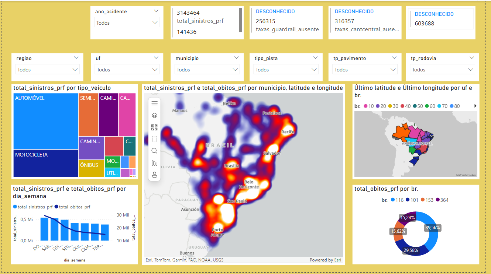

# 📌 MVP - SPRINT 1

## 🎯 Objetivo do MVP 
> Reduzir a maior quantidade de arquivos/ informações "desnecessárias" à análise. Para que a ideia central permita a visualização de sinistros que ocorreram devido às condições da infraestrutura viária e geometria das vias.

---

## 📝 Descrição da Solução
> Unificação dos anos (2018 à 2024) e tratamento das bases de dados (remoção de colunas desnecessárias à analise, linhas em branco, limitar a municípios que possuem populução igual e/ou superior a 100 mil habitantes). Nos esboço do dashboard, foram adicionados filtros e mapas que visam facilitar a visualização do problema à nivel municipal, estadual e federal.
---

## 📅 Sprint(s) Relacionadas
| Sprint | Entregas Principais                          | Status   |
|--------|----------------------------------------------|----------|
| 01     | [Divisão das funções e exigências da equipe]                    | Concluído |
| 02     | [Elaboração das user stories]                                   | Concluído |
| 03     | [Busca e análises das bases de dados]                           | Concluído |
| 04     | [Tratamento e unificação das bases de dados]                    | Concluído |
| 05     | [Novos arquivos CSV)]                                           | Concluído |
| 06     | [Esboço/Rascunho do dashboard]                                  | Concluído |

---

## 📂 Anexos / Evidências
- Prints de tela

 
A imagem acima demonstra os resultados.

- Códigos Colab

- Vídeo (MVP)  
